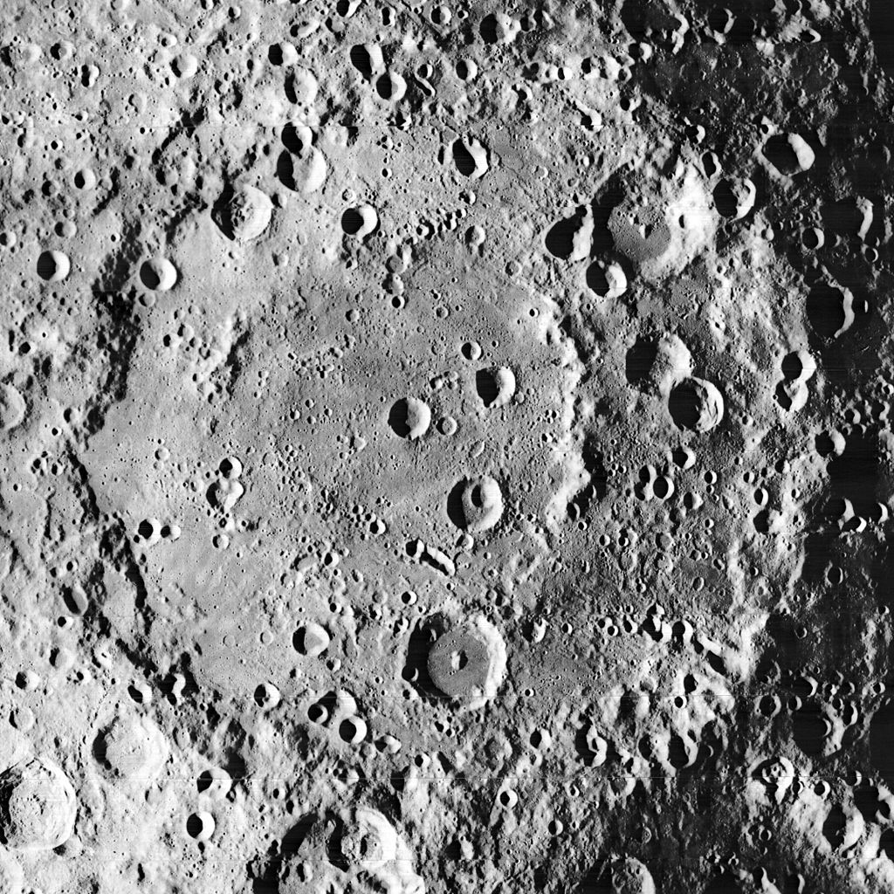
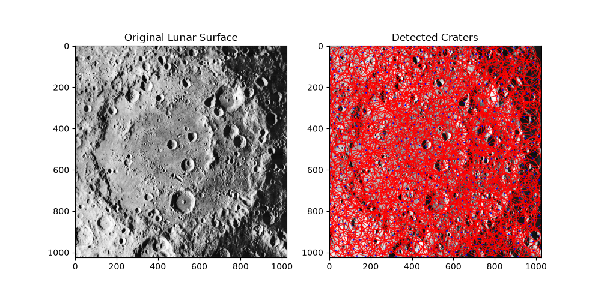

# Moon-crator-detection-Method-A-
 Automated lunar crater detection using Python and digital image processing (Hough Circle Transform). A computer vision pipeline built for planetary surface mapping.
## 🚀 Project Overview

When spacecraft land on the Moon or Mars, they must identify surface hazards like craters in real time. This project uses **Python** and **OpenCV** to process high-resolution satellite imagery from the lunar surface. By applying noise-reduction filters and gradient edge detection, the script automatically maps circular crater boundaries and logs their coordinates.

### Key Features
*   **Image Preprocessing:** Grayscale conversion and Gaussian blurring to eliminate background terrain noise and microscopic rocks.
*   **Mathematical Extraction:** Utilizes the **Hough Circle Transform** to evaluate image gradients and calculate perfect circle boundaries.
*   **Visual Telemetry Output:** Draws bright tracking overlays identifying the crater rims (red) and exact center points (blue).

---

## 📸 Results & Output

| Original Satellite Imagery | Automated Crater Detection |
| :---: | :---: |
|  |  |

---

## 🛠️ Tech Stack & Requirements

*   **Language:** Python 3.x
*   **Libraries:** 
    *   `opencv-python` (Core image processing & Hough Transform)
    *   `numpy` (Matrix mathematical calculations on image pixels)
    *   `matplotlib` (Side-by-side data visualization)

### Installation

Clone the repository and install the required dependencies:

```bash
git clone https://github.com
cd lunar-crater-detection-cv
pip install opencv-python numpy matplotlib
```

---

## 💻 How It Works (Code Architecture)

The core script (`detect_craters_cv.py`) breaks down the computer vision task into five distinct phases:

1.  **Matrix Loading:** Reads the lunar image as a 2D matrix of pixel intensity values (grayscale).
2.  **Gaussian Smoothing:** Applies a $5 \times 5$ Gaussian kernel filter to smooth out high-frequency noise without losing structural crater edges.
3.  **Gradient Evaluation:** Scans pixel contrast boundaries using the internal Canny edge detector built into the Hough Gradient method.
4.  **Circle Accumulation:** Votes on center points ($x, y$) and radii ($r$) to pinpoint valid circular depressions.
5.  **Rendering:** Overlays the geometric coordinates back onto a BGR color space for the final engineering display.

---

## 📈 Engineering Parameters

To achieve highly accurate detection rates, the `cv2.HoughCircles` function utilizes the following structural constraints:
*   `dp=1.2`: Inverse ratio of the accumulator resolution to the image resolution.
*   `minDist=30`: Ensures overlapping craters don't collapse into a single detection marker.
*   `param1=50`: The higher threshold passed to the edge detector.
*   `param2=35`: The accumulator threshold for center detection (controls false alarms vs. missed detections).

---

## 🌌 Future Roadmap

*   **Phase 2 (Method B):** Transition from explicit geometric rule programming to a Deep Learning architecture utilizing **YOLOv8** for irregular, non-circular, and heavily eroded craters.
